# Deploying .NET Core application to Azure Kubernetes Cluster in less than 5$

Microservice architecture and docker are becoming more and more popular these days. 
In this article, I will shortly brief you through some main terminologies and show you how to:

* Dockerise an ASP .NET Core application
* Create and run docker image
* Use this image in your local kubernetes cluster
* Create Azure Container Register and push your image there
* Setup Azure Kubernetes Service and connect it to ACR
* Scale you cluster and change number of replicas
* And the most important: how to clean all those mess

### What you need to know:
* Microservice architecture is an approach to split application to small, 
single responsible services which could be developed and scaled separately instead of one big monolith application
* Container is a nano-server which can be use instead virtual machines as a host for an app
* Container register is a place where you can store and share your containerized apps images
* Docker is a tool designed to make it easier to create, deploy, and run applications by using containers
* Kubernetes is the most popular orchestration tool. It's used for managing containerized workloads and services, 
that facilitates both declarative configuration and automation.

By default Docker uses Docked Swarm for an orchestration but in a new version of Docker Desktop (both for macOS or Windows) you can change that to use Kubernetes.

## Pre-requirements
* Have a macOS or Windows operation system (it should work as well on Linux but this article won't cover that)
* Enable Hyper-V on your machine if you haven't done it yet (for windows users only)
* Install or update [Docker Desktop](https://hub.docker.com/?overlay=onboarding)

<p align="center">
  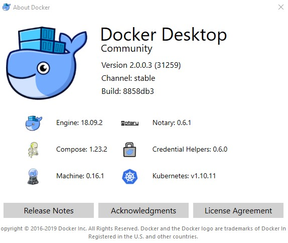
</p>


* Install [Azure CLI](https://docs.microsoft.com/pl-pl/cli/azure/install-azure-cli?view=azure-cli-latest) - we will need that a little bit later

## Run the app
In the next few steps we will try four different approaches to run the app:
* locally
* via local docker instance
* via your local kubernetes instance
* via kubernetes on an azure

### So let's get started

It will be much simpler to have the same codebase so open your PowerShell and clone [my repository](https://github.com/szczepanbh/shkube). 


We can find here the simplest possible asp.net core application which should display a `Message` from 
`appsettings.json` and your `machine name`. If you have installed .NET Core Runtime you can build
and run the app locally without docker:
* navigate to project folder `SHKube`
* run the application `dotnet run`

Application is listening on port **5000** so open your browser and navigate to http://localhost:5000. 
We should see the name of our machine.

<p align="center">
  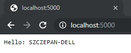
</p>


### Now it's time to dockerize our app

There are at least two ways to build and run an app inside docker: via command line only or by using `Dockerfile`. 
I thing that second approach is more readable so I will use it in this example so please take a look at the `Dockerfile` 
inside a project folder.

```
FROM mcr.microsoft.com/dotnet/core/aspnet:2.2-stretch-slim AS base
WORKDIR /app

FROM mcr.microsoft.com/dotnet/core/sdk:2.2-stretch AS build
WORKDIR /src
COPY ["*.csproj", "./"]
RUN dotnet restore
COPY . ./
WORKDIR /src
RUN dotnet build  -c Release -o /app

FROM build AS publish
RUN dotnet publish -c Release -o /app

FROM base AS final
WORKDIR /app
COPY --from=publish /app .
ENTRYPOINT ["dotnet", "SHKube.dll"]
```

What we have here is a **multi-stage build**. We are using two image from [DockerHub](https://hub.docker.com/). 
* `mcr.microsoft.com/dotnet/core/sdk:2.2-stretch` is used to build an app - it contains .NET Core SDK which is necessary to build a our app
* `mcr.microsoft.com/dotnet/core/aspnet:2.2-stretch-slim` which is lighter and contains only .NET Core Runtime to run our app

So letls build a new image with our app.

```
docker build . -t shkube:local
```

We have named the image `shkube` and tagged it `local`.
Checkout if the image is on a list of local images

```
docker image list | select -First 2
```

or just `docker image list` to see all images.

And finally let's run this image 

```
docker run -d -p 5000:80 shkube:local
```

* `-d` means detached mode - run in a background and print container ID
* `-p` binds port `80` of a container to port `5000` of a host

Open browser and navigate to http://localhost:5000. 
We should now see the ID of a container.

<p align="center">
  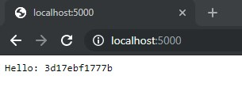
</p>


Now we can use `docker stop` to stop and `docker rm` to remove out container or just

```
docker container rm -f $(docker ps -aq)
```

to clean everything.

### We can now move to kubernetes

Open docker settings and open **Kubernetes** tab and select two checkboxes like on a screen below. 
Wait for installation to finish. It should look very similar for macOS users.

<p align="center">
  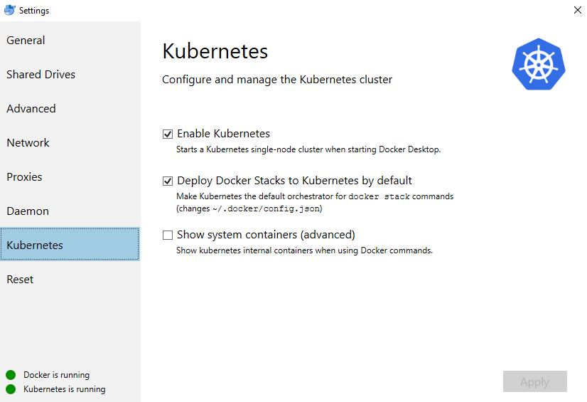
</p>


As with **Dockerfile** we can use **yml file** to have all configuration necessary for kubernetes in one place. 

Open **shkubedeploy.yml**

```
apiVersion: apps/v1
kind: Deployment
metadata:
  name: shkube-deployment
  labels:
    app: shkube
spec:
  replicas: 1
  template:
    metadata:
      name: shkube
      labels:
        app: shkube
    spec:
      containers:
      - name: shkube
        image: shkube:local
        imagePullPolicy: IfNotPresent
      restartPolicy: Always
  selector:
    matchLabels:
      app: shkube


---

apiVersion: v1
kind: Service
metadata:
  name: shkube-service
spec:
  selector:
    app: shkube
  ports:
    - port: 80
  type: NodePort
```


We have just created a new **Deployment** for kubernetes. 
It contains one service named `shkube-service` which expose port `80` and contains one instance `replicas: 1`
of our container image `shkube:local`. Containers are ephemeral. It could just die. Kubernetes will take care to run a new instance 
of our container if it happens. It is recommended to have at least three instance. We will scale it up a later.
Now we have to run our deployment.


```
kubectl create -f .\shkubedeploy.yml
```


And checkout if out service is still pending or not.


```
kubectl get svc --watch
```

<p align="center">
  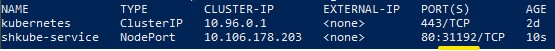
</p>

Grab a port number and open your browser. In my case it is http://localhost:31192/ .
Now we should see the name of deployment.

<p align="center">
  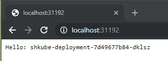
</p>


### Let's clean this mess:


```
kubectl delete -f .\shkubedeploy.yml
```

Simple as that!


### Final - welcome Azure

With azure things are a little bit more complicated but don't worry - we can handle that! 
We have to add few additional steps before we can run with our deployment:
* Create a Azure Resource Group to have everything in one place
* Create Azure Container Register (ACR) to push and share our local image
* Add Azure Service Principal to be able to use our ACR with Azure Kubernetes Service (AKS)
* Create AKS
* And then we can spin out our deployment

Login to Azure from PowerShell.

```
az login
```

Create Resource Group/

```
az group create -n shkuberg -l westeurope
```

* `-n` stands for name
* `-l` stands for region (I have picked up West Europe because it's the closest one but it doesn't matter in this case)


Next create AZURE CONTAINER REGISTER

```
az acr create -n shkubeacr -g shkuberg --sku standard
```

* `-g` stands for resource group
* `--sku` stands for Stock Keeping Unit (available options: Basic, Classic, Premium, Standard)

Find `loginServer`, we will need that in a moment (mine is `shkubeacr.azurecr.io`).

Checkout if our ACR in ready.

```
az acr list -o table
```

And login to ACR.

```
az acr login -n shkubeacr 
```

New lets tag to our existing image to match the ACR name. Use `loginServer` that you have stored before.

```
docker tag shkube:local shkubeacr.azurecr.io/shkube:v1
```

Check out all local images.

```
docker image list
```

We now see two images with the same ID but different tags. Push an image to the ACR

```
docker push shkubeacr.azurecr.io/shkube:v1
```

And check if it is there

```
az acr repository list -n shkubeacr -o table
```


**Good job!**

### Now we have to add Azure Service Principal 

Create a service principal and configure its access to Azure resources.

```
az ad sp create-for-rbac --skip-assignment
```

Remember the `appId` and `password`? - we need those now. Mine are

```
"appId": "cfed7ab3-8db9-4bba-86c9-2311d505d2ad",
"password": "7193c36f-3123-4453-8ee7-2aa7bf071007",
```

Create a new role assignment. (use your appId after `--assignee`)

```
$acrId = az acr show --name shkubeacr --resource-group shkuberg --query "id" --output tsv

az role assignment create --assignee "cfed7ab3-8db9-4bba-86c9-2311d505d2ad" --role Reader --scope $acrId
```

And you are done with permissions.

### Let's Azure Kubernetes Service


```
az aks create `
 --name shkubeakscluster `
 --resource-group shkuberg `
 --node-count 1 `
 --generate-ssh-keys `
 --service-principal "cfed7ab3-8db9-4bba-86c9-2311d505d2ad" `
 --client-secret "7193c36f-3123-4453-8ee7-2aa7bf071007"
```

* use `appId` for `service-principal`
* and `password` for `client-secret`

It's a good moment for a short break so grab yourself a coffee and wait.


You have just created a single, brand new ASK. 

Check where your kube context point to.

```
cat C:\Users\{yourLocalUserName}\.kube\config | more
```

<p align="center">
  
</p>

You should see **localhost** here but we have to add the one from Azure.

```
az aks get-credentials --name shkubeakscluster --resource-group shkuberg
```

Check again.

```
cat C:\Users\{yourLocalUserName}\.kube\config | sls "shkubeakscluster"
```

<p align="center">
  
</p>

Let's check a list of nodes.

```
kubectl get nodes
```

And grab ACR Login server to update our `shkubedeploy.yml` file.

```
az acr list --resource-group shkuberg --query "[].{acrLoginServer:loginServer}" --output table
```

Open `shkubedeploy.yml` file and change `image` to the one from ACR instead of local image 
and change the service spec type to LoadBalancer instead of NodePort because we are on azure now.

<p align="center">
  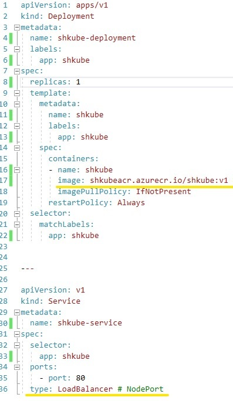
</p>


And you are ready to go. Upload your config file and wait for it to be ready.

```
kubectl apply -f .\shkubedeploy.yml
kubectl get service --watch
```

<p align="center">
  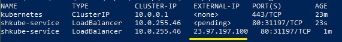
</p>


Copy an IP and checkout in a browser.


<p align="center">
  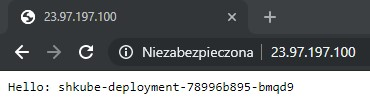
</p>


We can now increase a number of kubernetes clusters

```
kubectl get nodes
az aks scale --name shkubeakscluster --resource-group shkuberg `
 --node-count 3
kubectl get nodes
```

<p align="center">
  
</p>

or change the number of replicas.
```
kubectl get deployment
kubectl scale --replicas=5 deployment/shkube-deployment
kubectl get deployment
```

<p align="center">
  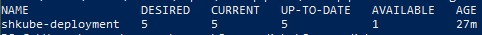
</p>


**But how to update our application now?**

Let's change a `Message` in `appsettings.json` to **Hello azure: ". 
As before we have to build a new image and push it to register.

```
docker build . -t shkubeacr.azurecr.io/shkube:v2
docker push shkubeacr.azurecr.io/shkube:v2
```

We have to update our deployment file to point to the new image and 
change the number of replicas to have the same value as it it on Azure now.
Open and edit `shkubedeploy.yml`

<p align="center">
  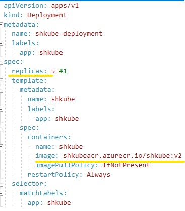
</p>


 
And apply all changes.

```
kubectl apply -f .\shkubedeploy.yml
```

Refresh your browse and you should see a new message!

<p align="center">
  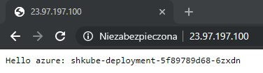
</p>


## This is it! You are ready to clean all the mess you have made

* Remove a deployment
```
kubectl delete -f .\shkubedeploy.yml
```
* Remove kubernetes clusters
```
az aks delete --name shkubeakscluster --resource-group shkuberg
```
* Remove container register
```
az acr delete -n shkubeacr
```
* Remove resource group
```
az group delete --name shkuberg
```
* And switch back to your local kubernetes context
```
kubectl config use-context docker-for-desktop
kubectl config unset contexts.shkubeakscluster
```


## Summary

Do you remember those times when your app was working locally but now on a production and how hard it is to debug? 
And this strange behaviour when your single-node was scaled horizontally and can't figure  out what it wrong?

We have walked through a long journey to proof that now it can be done better.

* We have run **the same ASP.NET Core application** locally and inside docker container. 
* We have used **the same docker container image** with and without kubernetes. 
* We have used **the same kubernetes deployment configuration** on our workstation and then on Azure.

And we have made it in less than 5$ ;)

